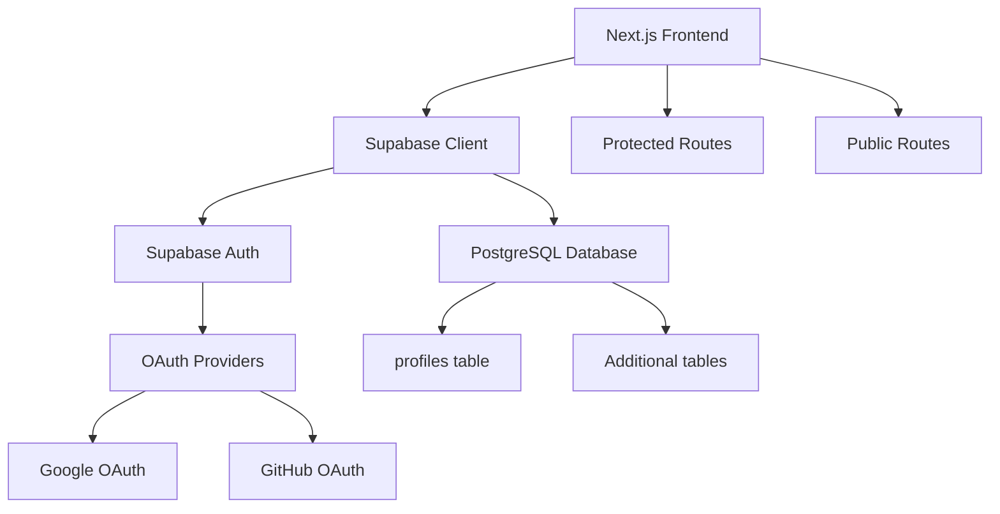
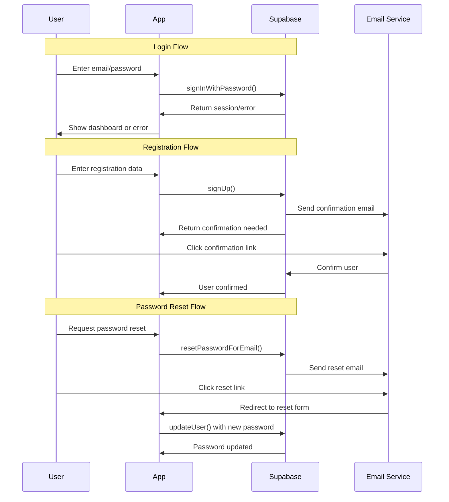

# Design Document - Supabase OAuth & Database Integration

## Overview

Esta implementação integrará o Supabase como backend completo para o MagApp, fornecendo autenticação OAuth, banco de dados PostgreSQL e gerenciamento de sessões. A arquitetura seguirá as melhores práticas do Next.js 15 com App Router e React 19.

## Architecture

### High-Level Architecture



### Authentication Flow



## Components and Interfaces

### 1. Supabase Configuration

**File:** `lib/supabase/client.ts`
```typescript
interface SupabaseConfig {
  url: string;
  anonKey: string;
  options?: {
    auth: {
      autoRefreshToken: boolean;
      persistSession: boolean;
      detectSessionInUrl: boolean;
    };
  };
}
```

### 2. Authentication Context

**File:** `contexts/AuthContext.tsx`
```typescript
interface AuthContextType {
  user: User | null;
  loading: boolean;
  signIn: (email: string, password: string) => Promise<void>;
  signUp: (email: string, password: string, name?: string) => Promise<void>;
  signOut: () => Promise<void>;
  resetPassword: (email: string) => Promise<void>;
  updatePassword: (password: string) => Promise<void>;
  updateProfile: (data: ProfileUpdate) => Promise<void>;
}
```

### 3. Database Types

**File:** `types/database.ts`
```typescript
interface Profile {
  id: string;
  email: string;
  name: string | null;
  avatar_url: string | null;
  created_at: string;
  updated_at: string;
}

interface Database {
  public: {
    Tables: {
      profiles: {
        Row: Profile;
        Insert: Omit<Profile, 'id' | 'created_at' | 'updated_at'>;
        Update: Partial<Omit<Profile, 'id' | 'created_at'>>;
      };
    };
  };
}
```

### 4. Protected Route Component

**File:** `components/auth/ProtectedRoute.tsx`
```typescript
interface ProtectedRouteProps {
  children: React.ReactNode;
  fallback?: React.ReactNode;
  redirectTo?: string;
}
```

## Data Models

### Database Schema

#### profiles table
```sql
CREATE TABLE profiles (
  id UUID REFERENCES auth.users(id) PRIMARY KEY,
  email TEXT NOT NULL,
  name TEXT,
  avatar_url TEXT,
  created_at TIMESTAMP WITH TIME ZONE DEFAULT NOW(),
  updated_at TIMESTAMP WITH TIME ZONE DEFAULT NOW()
);

-- RLS Policies
ALTER TABLE profiles ENABLE ROW LEVEL SECURITY;

CREATE POLICY "Users can view own profile" ON profiles
  FOR SELECT USING (auth.uid() = id);

CREATE POLICY "Users can update own profile" ON profiles
  FOR UPDATE USING (auth.uid() = id);
```

#### Triggers for automatic profile creation
```sql
CREATE OR REPLACE FUNCTION public.handle_new_user()
RETURNS TRIGGER AS $$
BEGIN
  INSERT INTO public.profiles (id, email, name, avatar_url)
  VALUES (
    NEW.id,
    NEW.email,
    NEW.raw_user_meta_data->>'name',
    NEW.raw_user_meta_data->>'avatar_url'
  );
  RETURN NEW;
END;
$$ LANGUAGE plpgsql SECURITY DEFINER;

CREATE TRIGGER on_auth_user_created
  AFTER INSERT ON auth.users
  FOR EACH ROW EXECUTE FUNCTION public.handle_new_user();
```

## Error Handling

### Error Types
```typescript
enum AuthErrorType {
  NETWORK_ERROR = 'network_error',
  INVALID_CREDENTIALS = 'invalid_credentials',
  SESSION_EXPIRED = 'session_expired',
  OAUTH_CANCELLED = 'oauth_cancelled',
  PROFILE_UPDATE_FAILED = 'profile_update_failed'
}

interface AuthError {
  type: AuthErrorType;
  message: string;
  details?: any;
}
```

### Error Handling Strategy
- Network errors: Retry with exponential backoff
- OAuth errors: Clear messaging and retry options
- Session errors: Automatic refresh or redirect to login
- Validation errors: Field-specific error messages

## Testing Strategy

### Unit Tests
- Supabase client configuration
- Authentication context logic
- Profile update functions
- Error handling utilities

### Integration Tests
- OAuth flow end-to-end
- Database operations
- Protected route access
- Session management

### E2E Tests
- Complete login/logout flow
- Profile management
- Route protection
- Error scenarios

## Security Considerations

### Authentication Security
- Use HTTPS in production
- Secure cookie settings
- CSRF protection
- Rate limiting on auth endpoints

### Database Security
- Row Level Security (RLS) enabled
- Proper user permissions
- Input validation and sanitization
- SQL injection prevention

### Environment Variables
- Separate keys for dev/prod
- No sensitive data in client-side code
- Proper secret management in Railway

## Performance Optimizations

### Client-Side
- Lazy loading of auth components
- Memoization of user context
- Optimistic updates for profile changes
- Proper loading states

### Server-Side
- Database connection pooling
- Query optimization
- Caching strategies
- CDN for static assets

## Deployment Configuration

### Environment Variables Required
```env
# Supabase
NEXT_PUBLIC_SUPABASE_URL=your_supabase_url
NEXT_PUBLIC_SUPABASE_ANON_KEY=your_supabase_anon_key
SUPABASE_SERVICE_ROLE_KEY=your_service_role_key

# Email Configuration (configured in Supabase dashboard)
# SMTP settings for email confirmation and password reset

# App Configuration
NEXT_PUBLIC_APP_URL=https://your-app.railway.app
```

### Railway Configuration
- Environment variables setup
- Database connection
- OAuth redirect URLs configuration
- Domain configuration for production

## Migration Strategy

### Phase 1: Basic Setup
- Supabase project creation
- Basic authentication setup
- Simple login/logout

### Phase 2: Enhanced Features
- Profile management
- Protected routes
- Error handling

### Phase 3: Production Ready
- Security hardening
- Performance optimization
- Monitoring and analytics